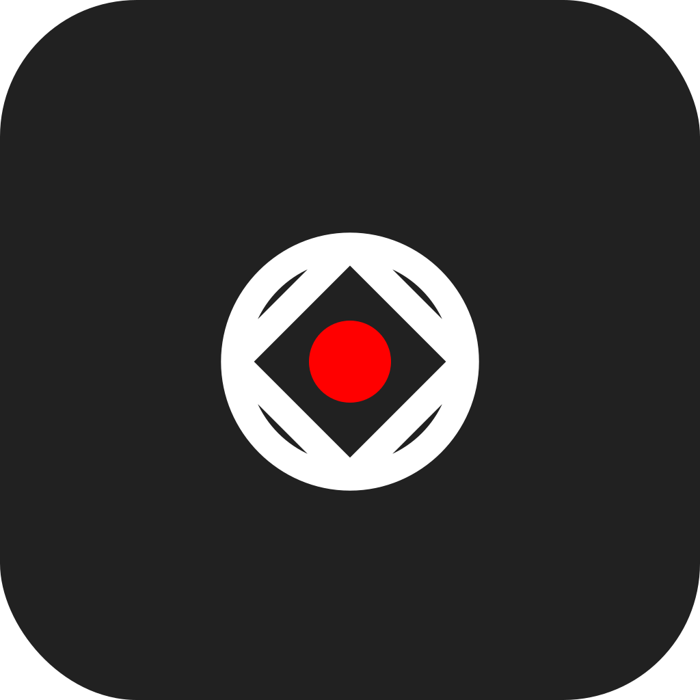
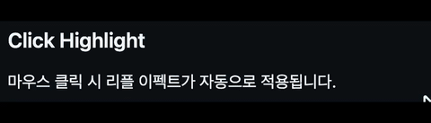
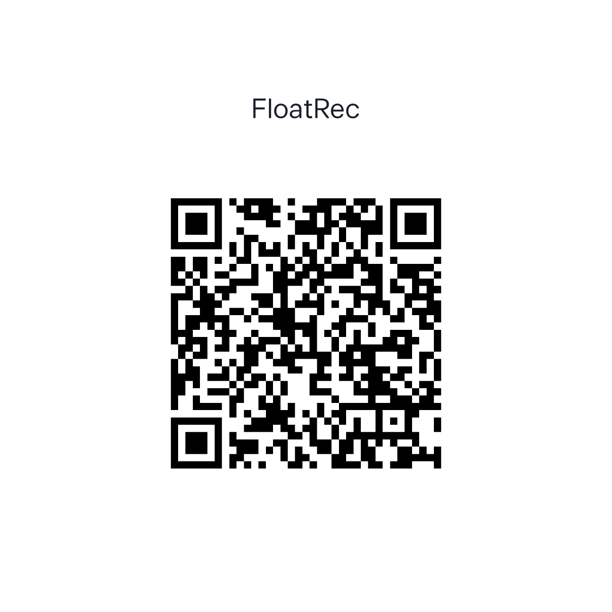

<div align="center">



# FloatRec

**Record your screen. Control the camera. Drag to share.**

Live Camera Control · Click Highlight · Instant Drag & Share

[](https://swift.org)
[](https://developer.apple.com/macos/)
[](https://developer.apple.com/documentation/screencapturekit)

<br>

[](https://github.com/kanguk01/FloatRec/releases/latest)

<br>


</div>

<br>

## Why FloatRec?

macOS 기본 녹화에는 없는 기능들:

- **시스템 오디오 캡처** — 앱에서 나오는 소리를 별도 설정 없이 바로 녹화
- **마이크 동시 녹음** — 시스템 사운드 + 내 목소리를 한 파일로
- **실시간 카메라 제어** — 녹화 중 단축키로 줌·팔로우·스포트라이트
- **일시정지/재개** — 불필요한 구간을 잘라내고 하나의 영상으로
- **GIF 내보내기** — 짧은 클립을 바로 GIF로 변환
- **자동 저장** — 지정 폴더에 녹화 종료 시 자동 복사

## Install

### Homebrew

```bash
brew tap kanguk01/floatrec
brew install --cask floatrec
```

### Manual

1. [최신 릴리즈](https://github.com/kanguk01/FloatRec/releases/latest)에서 `FloatRec.dmg` 다운로드
2. FloatRec.app을 응용 프로그램 폴더로 드래그
3. 첫 실행 시 화면 녹화 권한 허용

> **요구 사항** — macOS 14.0 (Sonoma) 이상 · 라이브 녹화는 macOS 15+ 필요 · 마이크 캡처는 macOS 15.4+

## Features

### Recording

녹화 시작 시 통합 선택 오버레이가 뜨며, 하단 툴바에서 모드를 전환하고 대상을 클릭하면 바로 녹화가 시작됩니다.

| 모드 | 설명 |
|------|------|
| **Display** | 전체 디스플레이 녹화 |
| **Window** | 개별 앱 윈도우 캡처 |
| **Area** | 전체화면 오버레이에서 드래그로 영역 선택 |

### Audio Capture

macOS 기본 녹화와 달리, **시스템 사운드와 마이크를 독립적으로 제어**할 수 있습니다.

| 옵션 | 설명 |
|------|------|
| **시스템 사운드** | 앱에서 재생되는 소리를 녹화 (브라우저 영상, 음악 등) |
| **마이크** | 마이크 입력을 함께 녹화 (나레이션, 설명 등) |

둘 다 켜면 시스템 사운드 + 마이크가 한 파일에 믹스됩니다.

### Manual Camera

녹화 중 단축키로 줌 스텝, 커서 팔로우, 스포트라이트를 실시간 제어합니다. 녹화 종료 후 후처리를 통해 최종 영상에 반영됩니다.

### Pause & Resume

녹화 중 `⌘⇧P`로 일시정지, 다시 누르면 재개. 일시정지 구간은 최종 영상에서 자동으로 제거됩니다.

### Keyboard Shortcuts

| 단축키 | 동작 |
|--------|------|
| `⌘⇧9` | 녹화 시작 (선택 오버레이 표시) |
| `⌘⇧0` | 녹화 종료 |
| `⌘⇧P` | 일시정지 / 재개 |
| `⌃1` | 줌 스텝 (1.22x → 1.86x) |
| `⌃2` | 커서 팔로우 모드 토글 |
| `⌃3` | 오버뷰로 리셋 |
| `⌃4` | 스포트라이트 토글 |

녹화 중 화면 상단에 HUD가 떠서 경과 시간, 카메라 상태, 단축키 안내를 실시간으로 보여줍니다.

### Click Highlight

마우스 클릭 시 리플 이펙트가 자동으로 적용됩니다.

<div align="center">

</div>

### GIF Export

셸프에서 클립의 "GIF" 버튼을 누르면 15fps/640px GIF로 변환하여 저장할 수 있습니다.

### Floating Shelf

녹화가 끝나면 우하단에 플로팅 셸프가 나타납니다. 최소화하여 작은 탭으로 줄이거나, 다시 펼쳐서 클립을 관리할 수 있습니다.

- 썸네일 미리보기 · 재생 시간 표시
- 저장 / GIF / 복사 / Finder / 드래그 앤 드롭
- 최소화 / 복원

<div align="center">

</div>

## Settings

| 옵션 | 기본값 | 설명 |
|------|--------|------|
| 카메라 후처리 | On | 녹화 결과에 줌·팔로우·스포트라이트 적용 |
| 클릭 강조 | On | 클릭 리플 이펙트 |
| 기본 스포트라이트 | On | 녹화 시작 시 스포트라이트 기본 활성화 |
| 시스템 사운드 | Off | 앱에서 재생되는 소리 녹화 |
| 마이크 | Off | 마이크 입력 함께 녹화 |
| 자동 저장 경로 | 없음 | 설정 시 녹화 종료마다 자동 복사 |

설정은 앱을 재시작해도 유지됩니다.

<details>
<summary><h2>Architecture</h2></summary>

```
Sources/FloatRec/
├── App/                  # 앱 진입점
├── Features/
│   ├── MenuBar/          # 메뉴바 드롭다운 UI
│   ├── Shelf/            # 플로팅 셸프
│   └── Settings/         # 설정 창
├── Models/               # 데이터 모델, 상태 열거형
├── Services/             # 핵심 비즈니스 로직
│   ├── ScreenCaptureRecorder      # SCStream 녹화 관리
│   ├── RecordingCoordinator       # 녹화 라이프사이클 조율
│   ├── AutoZoomProcessor          # 카메라 제어 후처리
│   ├── CursorTrackingService      # 프레임별 커서 추출
│   ├── CaptureSelectionOverlay    # 통합 캡처 대상 선택 UI
│   ├── GIFExporter                # GIF 변환
│   └── ...
└── Support/              # 유틸리티, 포매터
```

### Recording Pipeline

```
⌘⇧9 → 통합 선택 오버레이 (디스플레이 / 윈도우 / 영역)
  → SCStream 시작 (적응형 FPS + 시스템 오디오 + 마이크)
    → 원본 MP4 저장 + 커서 트랙 추출
      → ⌃1~⌃4 카메라 이벤트 기록
        → ⌘⇧P 일시정지 / 재개 (세그먼트 분할 + 병합)
          → 후처리: 줌·팔로우·스포트라이트·클릭 하이라이트 합성
            → 최종 클립 → Shelf (저장 / GIF / 공유)
```

</details>

<details>
<summary><h2>Support</h2></summary>

FloatRec이 유용하셨다면 커피 한 잔 사주세요 :)

<div align="center">

<br>
<sub>Toss로 후원하기</sub>
</div>

</details>

## License

Private — All rights reserved.
